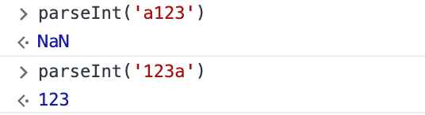

```js
console.log(parseInt('a123') == Number("123z"));

console.log(typeof "10"/5 + typeof NaN);

console.log(isNaN(("10"/5))); 

console.log(typeof (50 + +"100px") === "number" ? "orange" : "apple");
```
각 콘솔로그는 무엇을 출력할까요? (보기 중 선택)  

a. false, "2number", true, "apple"  

b. true, "2number", false, "orange"  

c. false, "NaNnumber", false, "orange"   

d. true, "NaNnumber", true, "apple"   


<br/>

내가 선택한 답안 : a  

❓ 답을 고른 이유
> parseInt는 문자열이 섞여 있어도 그 중 숫자로 이루어진 것이 있으면 그것만 숫자형으로 반환해주는 걸로 알고 있었고 Number는 그렇게 해주지 못하는 걸로 알고 있다.  
> 두번째 정답은 긴가민가 한데, javascript은 문자열로 숫자가 되어 있어도 연산을 하면 숫자로 바꿔서 연산을 한다고 알고 있다. 그래서 typeof "10"/5는 "number"이고 typeof NaN은 헷갈린다.
> 위의 이유로 세번째 답은 false라고 생각했다.
> `100px`는 숫자로 바꿀 수 없기 때문에 답은 apple이라고 생각했다.

<br/>

✅ 정답 : c
> 직접 콘솔에 쳐보면서 새로운 점을 알게 되었다. 내가 생각한 parseInt()와 Number()의 차이가 어느정도는 맞았지만 parseInt는 숫자가 앞에 와야 문자열이 같이 있어도 숫자로 바꿔주었다. 그렇지 않으면 NaN을 반환하였다. 

그리고 NaN == NaN 은 false 이다. 이것은 js 언어 설계 오류로 false가 나온다고 한다.  
  
> 콘솔에서 확인해보니 typeof "10"/5는 NaN이 나온다. 여기서 number가 나오기 위해서는 typeof("10"/5)을 하면 된다. typeof NaN 은 아이러니하게도 number가 나온다. 왜그런지 찾아보니 typeof는 데이터 타입을 찾게 되는데 `NaN은 실제로 숫자 데이터 타입`이라고 한다. NaN은 숫자가 아니라는 특별한 값으로 취급되지만 JavaScript의 데이터 타입 시스템에서 숫자 타입에 속한다고 한다.🤯

> isNaN("10"/5) "10"/5는 2이기 때문에 false가 답이 된다.

> `50 + + "100px"`은 NaN이지만 typeof로 하면 number가 되고 orange 가 답이 된다.

