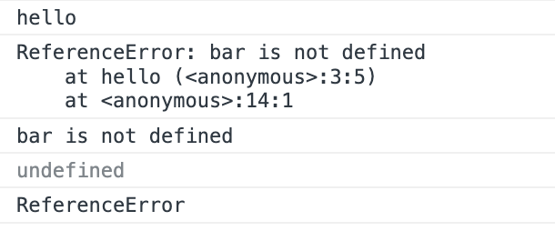

```js
function hello() {
  try {
    bar('Hi, there!')
  }
  catch (error1) {
    console.log(error1.message)
  }
}
```

다음 보기 중 하나를 고르세요. 그 이유도 알려주세요.

a. 'Hi, there!'  

b. 'bar is not defined'  

c. TypeError: Cannot read properties of undefined (reading 'message')

<br/>

내가 선택한 답안 : a  

❓ 답을 고른 이유
> try-catch문에서 try문을 통과하고 error 날 것이 없어서 try문만 실행 된다고 생각하였다.

<br/>

✅ 정답 : b
> try문에서 bar 함수를 실행해야 하는데 정의되어 있지 않다. 따라서 catch문으로 넘어가 error 객체가 만들어지고 error객체의 message 프로퍼티에는 "bar is not defined"가 저장된다.  
> 문제를 더 꼼꼼히 확인하자. 충분히 풀 수 있는 문제였음에도 불구하고 틀렸다.

<br/>

```js
function hello() {
  try {
    bar('Hi, there!')
    console.log('Hello, I am here!')
  }
  catch (error1) {
    console.log('hello')
    console.log(error1)
    console.log(error1.message)
    console.log(error1.error)
    console.log(error1.name)
  }
}
```
아래  코드는 무엇을 출력할까요?

<br/>

✅ 정답 : 

- ReferenceError : 객체는 현재 범위에서 존재하지 않거나 초기화되지 않은 변수를 참조했을 때 발생하는 에러를 나타냅니다.
- error1.message : 오류 메시지
- error1.name : 오류 이름
- mdn에서 확인한 결과 ReferenceError 에 error 속성은 없었습니다.
